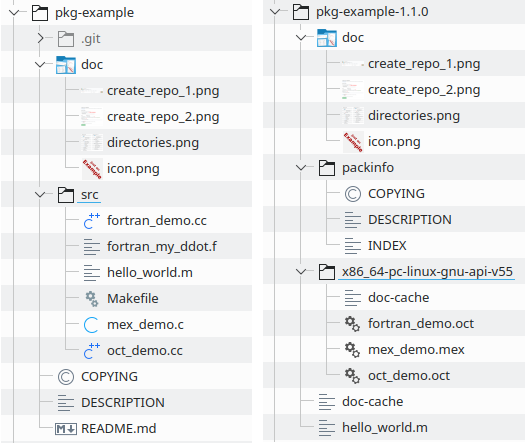

# pkg-example

A minimal [package example](https://octave.org/doc/latest/Creating-Packages.html)
for [GNU Octave](https://www.octave.org).  Contained examples are:

- `hello_world.m`: Octave/Matlab code
- `fortran_demo.cc` / `fortran_my_ddot.f`: FORTRAN code
  ([BLAS DDOT](https://github.com/Reference-LAPACK/lapack/blob/master/BLAS/SRC/ddot.f))
  called by the oct-interface
- `oct_demo.cc`: C++ code called by the oct-interface
- `mex_demo.cc`: C code called by the mex-interface

This package serves as template.  Installing it is of little use.
In the following, we describe the Octave package development,
if you decide to host your package on GitHub.
Of course you can use this package template outside GitHub as well.

> We recommend **not to fork** this repository.
> You are probably not interested in upstream changes or pull request.
> Just copy the files from the ZIP-archive into your fresh repository
> or follow the guide below.

**Content:**

1. Setup your package repository
2. Change your package repository to your needs
3. Install your package
4. Publish your package


## 1. Setup your package repository

- Join the [GNU Octave GitHub organization](https://github.com/gnu-octave)
  by asking for invitation at our
  [Discourse forum](https://octave.discourse.group/t/github-gitlab-organization-for-gnu-octave/178).

- Being part of the GNU Octave GitHub organization, you can easily create
  a new repository by using this one as template repository.

  

  


## 2. Change your package repository to your needs

In this section we give a brief introduction to the files and folders of this
repository and Octave packages in general.  We do not use all features of
Octave packages.  For a more complete feature documentation, see
[the Octave manual](https://octave.org/doc/latest/Creating-Packages.html).
The following figure gives an overview about what is installed
from this package repository.



On the left side of the figure above is a clone of this repository.
On the right side the installed package in the default Octave package
installation location.

- [`COPYING`](COPYING): The license text of the package.  If you are not a
  specialist in software law, we recommend to use a well established software
  license.  See <https://spdx.org/licenses/> for examples.

- [`DESCRIPTION`](DESCRIPTION): As defined in
  [the Octave manual](https://octave.org/doc/latest/Creating-Packages.html).

- These two files are installed to a directory `packinfo` and tools like
  `pkg describe` use this information:

  ```
  >> pkg describe -verbose pkg-example
  ---
  Package name:
          pkg-example
  Version:
          1.1.0
  Short description:
          Minimal example package to demonstrate the Octave package  extensions.  It shows how to organize Octave, C/C++,and FORTRAN code within  a package and to properly compile it.
  Depends on:
          octave >= 4.0.0
  Depended on by:

  Status:
          Not loaded
  ---
  Provides:
  package
          hello_world
          fortran_demo
          oct_demo
  ```

- `NEWS`: If this file is provided,
  the command `news pkg-example` prints it on the screen.

- [`doc`](doc): Optional folder.
  All content is copied to the package installation directory.

- [`src`](src): **All source code** (Octave m-files, C/C++, and FORTRAN)
  goes here.

  - [`src/Makefile`](src/Makefile): during the package installation,
    `pkg install` will call `make` with its default target (not
    `make install`, etc.).  Thus specify here how to compile
    **C/C++ and FORTRAN** source code, see the example.

    > **Note:** Only `.m`, `.mex`, and `.oct` files are finally copied to the
    > package installation directory.


## 3. Install your package

You can always install the latest development version of your package,
for example the `main` branch, with the command:

    pkg install "https://github.com/gnu-octave/pkg-example/archive/main.zip"

or for a specific release, for example `1.0.0`, with the command:

    pkg install "https://github.com/gnu-octave/pkg-example/archive/1.0.0.tar.gz"

For Octave 6.2.0 the **verbose** output will look like this:

```
>> pkg install -verbose "https://github.com/gnu-octave/pkg-example/archive/main.zip"
mkdir (/tmp/oct-zxAtnM)
unzip (/tmp/oct-uAfE0u/main.zip, /tmp/oct-zxAtnM)
make: Entering directory '/tmp/oct-zxAtnM/pkg-example-main/src'

/usr/bin/mkoctfile-6.2.0 --verbose       oct_demo.cc
g++ -c  -fPIC -I/usr/include/octave-6.2.0/octave/.. -I/usr/include/octave-6.2.0/octave  -pthread -fopenmp -g -O2    oct_demo.cc -o /tmp/oct-PF0ery.o
g++ -I/usr/include/octave-6.2.0/octave/.. -I/usr/include/octave-6.2.0/octave  -pthread -fopenmp -g -O2  -o oct_demo.oct  /tmp/oct-PF0ery.o  -shared -Wl,-Bsymbolic

/usr/bin/mkoctfile-6.2.0 --verbose --mex mex_demo.c
gcc -c  -fPIC -I/usr/include/octave-6.2.0/octave/.. -I/usr/include/octave-6.2.0/octave  -pthread -fopenmp -g -O2   -I.  -DMEX_DEBUG mex_demo.c -o /tmp/oct-HfunVf.o
g++ -I/usr/include/octave-6.2.0/octave/.. -I/usr/include/octave-6.2.0/octave  -pthread -fopenmp -g -O2  -o mex_demo.mex  /tmp/oct-HfunVf.o  -shared -Wl,-Bsymbolic

/usr/bin/mkoctfile-6.2.0 --verbose       fortran_demo.cc fortran_my_ddot.f
gfortran -c -fPIC -g -O2 -std=legacy -fdefault-integer-8    fortran_my_ddot.f -o /tmp/oct-gZtHRW.o
g++ -c  -fPIC -I/usr/include/octave-6.2.0/octave/.. -I/usr/include/octave-6.2.0/octave  -pthread -fopenmp -g -O2    fortran_demo.cc -o /tmp/oct-9fcW8V.o
g++ -I/usr/include/octave-6.2.0/octave/.. -I/usr/include/octave-6.2.0/octave  -pthread -fopenmp -g -O2  -o fortran_demo.oct  /tmp/oct-gZtHRW.o /tmp/oct-9fcW8V.o  -shared -Wl,-Bsymbolic
make: Leaving directory '/tmp/oct-zxAtnM/pkg-example-main/src'

copyfile /tmp/oct-zxAtnM/pkg-example-main/src/hello_world.m/tmp/oct-zxAtnM/pkg-example-main/inst
copyfile /tmp/oct-zxAtnM/pkg-example-main/src/fortran_demo.oct /tmp/oct-zxAtnM/pkg-example-main/src/oct_demo.oct /tmp/oct-zxAtnM/pkg-example-main/src/mex_demo.mex /tmp/oct-zxAtnM/pkg-example-main/inst/x86_64-pc-linux-gnu-api-v55
warning: doc_cache_create: unusable help text found in file 'mex_demo'
```


## 4. Publish your package

> What is the use of your package, if only you know about it?

You have several options to gain attention for your package:

- Add your package to [Octave Packages](https://gnu-octave.github.io/packages/).
- Announce your package at <https://octave.discourse.group/>.
- Announce your package at <https://wiki.octave.org/Packages>.
